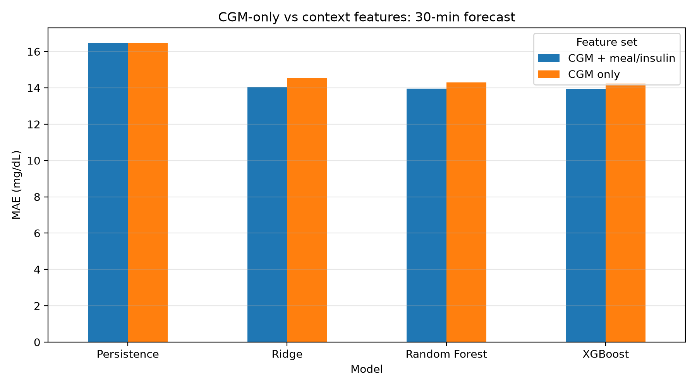
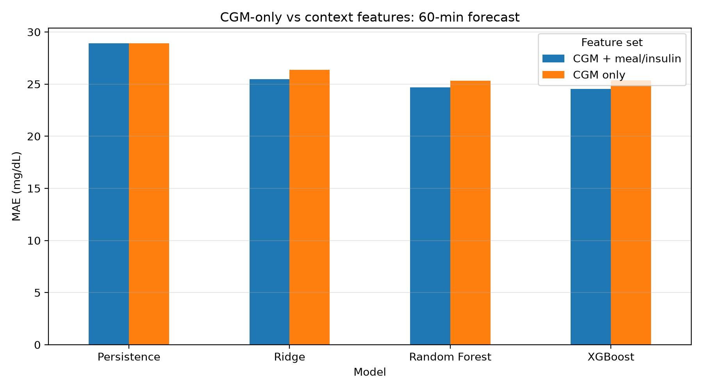
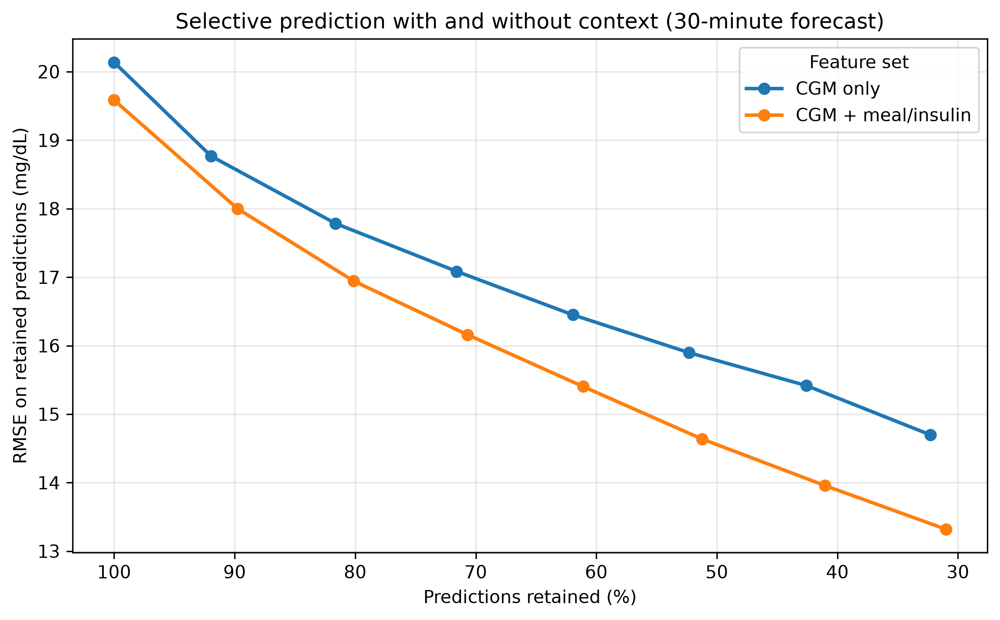
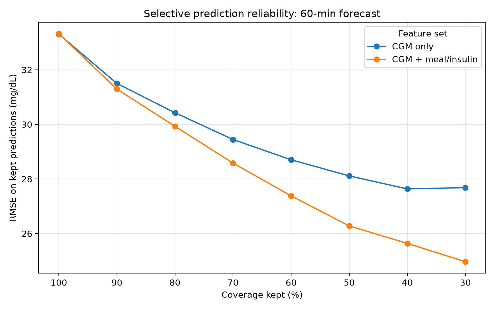

# GlucoTrust

Reliability-aware blood glucose forecasting from continuous glucose monitoring, insulin, meal, and activity data.

## Overview

GlucoTrust is a clinical machine learning project focused on short-term blood glucose forecasting. The goal is not only to predict future glucose values, but also to study when forecasts are unreliable and which input signals may be driving prediction instability.

The project is motivated by the idea that a forecasting model should not simply output a number. It should also communicate when its prediction may be difficult to trust, especially in safety-relevant situations such as hypoglycemia or hyperglycemia risk.

## Research Question

Can short-term blood glucose be forecast from recent CGM, meal, and insulin data, and can model uncertainty identify which forecasts are less reliable?

## Project Goals

- Build a reproducible glucose forecasting pipeline from raw diabetes time-series data.
- Predict blood glucose 30 and 60 minutes into the future.
- Compare persistence, Ridge regression, Random Forest, XGBoost, and XGBoost ensemble models.
- Evaluate the effect of adding meal and insulin context beyond CGM-only history.
- Estimate forecast uncertainty using ensemble disagreement.
- Test whether uncertainty can support selective prediction and abstention.
- Extend the project with wearable/life-event features, glucose-risk classification, and uncertainty attribution.

## Dataset

This project uses OhioT1DM-style XML files containing patient-level diabetes time-series data.

The current dataset contains:

- 6 patients
- 12 XML files
- 6 training files
- 6 testing files
- Approximately 41-46 training days per patient
- Approximately 9.5-10.4 testing days per patient

Parsed event streams include:

- CGM glucose readings
- Finger-stick glucose measurements
- Basal insulin events
- Temporary basal insulin events
- Bolus insulin events
- Meal/carbohydrate events
- Sleep events
- Work events
- Stressor events
- Hypoglycemia events
- Illness events
- Exercise events
- Wearable heart rate
- Wearable GSR
- Wearable skin temperature
- Wearable air temperature
- Wearable steps
- Wearable sleep states

## Dataset Source

The data used in this project comes from the OhioT1DM dataset. I accessed the dataset through the Kaggle-hosted OhioT1DM mirror:

- Kaggle dataset: `https://www.kaggle.com/datasets/ryanmouton/ohiot1dm`

The original OhioT1DM dataset was introduced for blood glucose level prediction research and includes continuous glucose monitoring, insulin, physiological sensor, and self-reported life-event data for people with type 1 diabetes.

Original dataset reference:

Marling, C., & Bunescu, R. (2020). *The OhioT1DM Dataset for Blood Glucose Level Prediction*.

Raw data files are not included in this repository. Users should obtain the dataset from the original source or the linked Kaggle mirror and place the XML files under `data/raw/` before running the pipeline.

## Current Data Pipeline

The current pipeline converts raw XML event streams into machine-learning-ready forecasting datasets.

Raw XML files are first summarized in a manifest, then parsed into event-level tables. CGM readings are resampled into a regular 5-minute timeline, lagged glucose features are generated, and meal/insulin event summaries are aligned to each timestamp without using future information.

Pipeline:

1. Raw XML files
2. XML file manifest
3. Parsed event tables
4. 5-minute CGM timeline
5. CGM-only lagged forecasting dataset
6. CGM + meal/insulin context forecasting dataset

Implemented scripts:

- `src/data/inspect_xml_files.py`
- `src/data/build_manifest.py`
- `src/data/parse_xml_events.py`
- `src/data/build_cgm_timeline.py`
- `src/features/build_cgm_lag_dataset.py`
- `src/features/build_context_dataset.py`
- `src/models/train_cgm_baselines.py`
- `src/models/train_context_baselines.py`
- `src/models/train_xgb_ensemble_uncertainty.py`
- `src/models/train_context_xgb_ensemble_uncertainty.py`
- `src/evaluation/selective_prediction.py`
- `src/evaluation/context_selective_prediction.py`
- `src/visualization/plot_cgm_baseline_results.py`
- `src/visualization/plot_uncertainty_bins.py`
- `src/visualization/plot_selective_prediction.py`
- `src/visualization/plot_context_comparison.py`
- `src/visualization/plot_context_selective_prediction.py`

## Prediction Setup

The project currently evaluates short-term glucose forecasting as a time-series regression task.

For each timestamp, the model uses recent patient history and available context to predict future glucose.

- Sampling interval: 5 minutes
- CGM input window: previous 2 hours
- Lag features: 0 to 120 minutes
- Forecast horizons: 30 minutes and 60 minutes
- Main task: future glucose regression

At 5-minute sampling:

- Past 2 hours = 24 previous time steps
- 30-minute forecast = 6 steps ahead
- 60-minute forecast = 12 steps ahead

## Processed Datasets

### CGM-only dataset

The CGM-only supervised dataset contains:

- 85,986 usable forecasting windows
- 70,035 training rows
- 15,951 testing rows
- 32 CGM-only lag/trend features
- 2 regression targets:
  - `target_glucose_30min`
  - `target_glucose_60min`

CGM-only features include:

- glucose lag values from 0 to 120 minutes
- glucose change over 30, 60, and 120 minutes
- rolling glucose mean over 30 and 60 minutes
- rolling glucose standard deviation over 30 and 60 minutes

### CGM + meal/insulin context dataset

The context dataset keeps the same forecasting windows and adds 26 meal/insulin context features.

Context features include:

- carbohydrates in the last 30, 60, 120, and 180 minutes
- meal counts in the last 30, 60, 120, and 180 minutes
- bolus insulin units in the last 30, 60, 120, and 180 minutes
- bolus event counts in the last 30, 60, 120, and 180 minutes
- bolus calculator carbohydrate input in the last 30, 60, 120, and 180 minutes
- time since last meal
- time since last bolus
- current basal insulin rate
- indicators for whether prior meal, bolus, and basal information are known

The combined dataset contains:

- 85,986 usable forecasting windows
- 70,035 training rows
- 15,951 testing rows
- 58 total model features
- 32 CGM-only features
- 26 meal/insulin context features

## CGM-Only Baseline Results

The first baseline uses only past CGM glucose values, without meal, insulin, exercise, or wearable features.

Models evaluated:

- Persistence baseline
- Ridge regression
- Random Forest regression
- XGBoost regression

The persistence baseline predicts that future glucose will equal current glucose.

| Model | 30-min MAE | 30-min RMSE | 30-min R² | 60-min MAE | 60-min RMSE | 60-min R² |
|---|---:|---:|---:|---:|---:|---:|
| Persistence | 16.48 | 22.96 | 0.862 | 27.47 | 36.93 | 0.642 |
| Ridge Regression | 14.56 | 20.67 | 0.888 | 25.21 | 33.59 | 0.703 |
| Random Forest | 14.31 | 20.59 | 0.889 | 24.83 | 33.73 | 0.701 |
| XGBoost | 14.28 | 20.63 | 0.888 | 24.58 | 33.44 | 0.706 |

Initial results show that machine learning models improve over the persistence baseline for both forecast horizons. The improvement is modest for 30-minute prediction, where current glucose is already a strong baseline, but becomes more meaningful at 60 minutes.

Ridge regression, Random Forest, and XGBoost perform similarly in the CGM-only setting. This suggests that much of the short-term signal is captured by glucose momentum and recent trend features.

## CGM + Meal/Insulin Context Results

Meal and insulin context features were added to test whether recent food and insulin events improve forecasting beyond glucose momentum alone.

| Model | Feature Set | 30-min MAE | 30-min RMSE | 30-min R² | 60-min MAE | 60-min RMSE | 60-min R² |
|---|---|---:|---:|---:|---:|---:|---:|
| Persistence | CGM only | 16.48 | 22.96 | 0.862 | 27.47 | 36.93 | 0.642 |
| Ridge Regression | CGM only | 14.56 | 20.67 | 0.888 | 25.21 | 33.59 | 0.703 |
| Random Forest | CGM only | 14.31 | 20.59 | 0.889 | 24.83 | 33.73 | 0.701 |
| XGBoost | CGM only | 14.28 | 20.63 | 0.888 | 24.58 | 33.44 | 0.706 |
| Ridge Regression | CGM + context | 14.04 | 20.02 | 0.895 | 24.23 | 32.40 | 0.724 |
| Random Forest | CGM + context | 13.95 | 20.16 | 0.893 | 24.27 | 33.20 | 0.710 |
| XGBoost | CGM + context | 13.94 | 20.13 | 0.894 | 24.00 | 32.60 | 0.721 |

Adding meal and insulin context modestly improved average forecasting error. The improvement was larger for the 60-minute horizon, where meal and insulin effects have more time to influence future glucose.

The strongest context result was the 60-minute Ridge model, which improved from 25.21 MAE with CGM-only features to 24.23 MAE with context features. XGBoost improved from 24.58 to 24.00 MAE at the 60-minute horizon.

Although the global MAE gains are modest, this result is important because the model is no longer relying only on glucose momentum. It can now use recent carbohydrate intake, insulin delivery, and basal rate context.

## Ensemble Uncertainty

To estimate forecast uncertainty, the project trains ensembles of 10 XGBoost models using bootstrapped training samples and different random seeds.

For each test prediction:

- `ensemble_mean` = average prediction across models
- `ensemble_std` = standard deviation across models

The ensemble mean is used as the final forecast. The ensemble standard deviation is used as an uncertainty estimate.

## CGM-Only Ensemble Reliability

| Target | MAE | RMSE | R² | Uncertainty-error Spearman |
|---|---:|---:|---:|---:|
| 30-min glucose | 14.29 | 20.60 | 0.889 | 0.221 |
| 60-min glucose | 24.50 | 33.30 | 0.709 | 0.184 |

The CGM-only ensemble achieved similar or slightly better performance than a single XGBoost model. More importantly, ensemble uncertainty was positively associated with actual forecast error.

## Context Ensemble Reliability

| Target | MAE | RMSE | R² | Uncertainty-error Spearman |
|---|---:|---:|---:|---:|
| 30-min glucose | 13.85 | 20.02 | 0.895 | 0.283 |
| 60-min glucose | 23.75 | 32.28 | 0.726 | 0.252 |

Adding meal and insulin context improved both forecasting accuracy and uncertainty-error alignment.

Compared with the CGM-only ensemble:

- 30-minute MAE improved from 14.29 to 13.85.
- 60-minute MAE improved from 24.50 to 23.75.
- 30-minute uncertainty-error Spearman improved from 0.221 to 0.283.
- 60-minute uncertainty-error Spearman improved from 0.184 to 0.252.

This suggests that meal and insulin context improves not only the model's point predictions, but also the usefulness of ensemble disagreement as a reliability signal.

## Uncertainty Bins

Predictions were sorted by ensemble uncertainty and split into five equal-frequency bins:

- very low uncertainty = most confident 20% of predictions
- low uncertainty = next 20%
- medium uncertainty = middle 20%
- high uncertainty = next 20%
- very high uncertainty = least confident 20% of predictions

### CGM-only uncertainty bins

At 30 minutes, median absolute error increased from 7.23 mg/dL in the lowest-uncertainty bin to 14.82 mg/dL in the highest-uncertainty bin.

At 60 minutes, median absolute error increased from 14.93 mg/dL to 26.19 mg/dL.

### Context uncertainty bins

For the context ensemble, uncertainty bins showed an even clearer separation.

| Target | Uncertainty Bin | Median Absolute Error | RMSE |
|---|---|---:|---:|
| 30-min glucose | Very low | 6.33 | 13.21 |
| 30-min glucose | Low | 7.92 | 15.24 |
| 30-min glucose | Medium | 9.06 | 17.71 |
| 30-min glucose | High | 11.62 | 21.72 |
| 30-min glucose | Very high | 15.83 | 28.48 |
| 60-min glucose | Very low | 13.63 | 23.13 |
| 60-min glucose | Low | 13.60 | 25.51 |
| 60-min glucose | Medium | 15.94 | 29.41 |
| 60-min glucose | High | 20.77 | 35.45 |
| 60-min glucose | Very high | 27.78 | 43.63 |

This separation indicates that ensemble disagreement is useful for distinguishing more reliable forecasts from less reliable forecasts.

## Selective Prediction

Selective prediction evaluates whether the model can improve reliability by abstaining from forecasts with high ensemble uncertainty.

Predictions are ranked from lowest uncertainty to highest uncertainty. Then the model keeps only the most confident predictions at each coverage level.

For example:

- 100% coverage = keep all predictions
- 80% coverage = keep the most confident 80%, reject the most uncertain 20%
- 60% coverage = keep the most confident 60%, reject the most uncertain 40%
- 40% coverage = keep the most confident 40%, reject the most uncertain 60%
- 30% coverage = keep the most confident 30%, reject the most uncertain 70%

This is not random subsampling. The retained predictions are specifically the predictions with the lowest ensemble uncertainty.

### CGM-only selective prediction

| Target | Coverage | RMSE |
|---|---:|---:|
| 30-min glucose | 100% | 20.59 |
| 30-min glucose | 80% | 17.98 |
| 30-min glucose | 60% | 16.85 |
| 30-min glucose | 40% | 15.85 |
| 30-min glucose | 30% | 15.55 |
| 60-min glucose | 100% | 33.30 |
| 60-min glucose | 80% | 30.43 |
| 60-min glucose | 60% | 28.70 |
| 60-min glucose | 40% | 27.64 |
| 60-min glucose | 30% | 27.68 |

### Context selective prediction

| Target | Coverage | RMSE |
|---|---:|---:|
| 30-min glucose | 100% | 20.02 |
| 30-min glucose | 80% | 17.26 |
| 30-min glucose | 60% | 15.50 |
| 30-min glucose | 40% | 14.26 |
| 30-min glucose | 30% | 13.84 |
| 60-min glucose | 100% | 32.28 |
| 60-min glucose | 80% | 28.75 |
| 60-min glucose | 60% | 26.14 |
| 60-min glucose | 40% | 24.35 |
| 60-min glucose | 30% | 23.75 |

Context-aware selective prediction produced a cleaner coverage-error tradeoff than the CGM-only version, especially for 60-minute forecasts. At 60 minutes, the context ensemble reduced RMSE from 32.28 at full coverage to 23.75 when retaining the most confident 30% of predictions.

This supports the main reliability claim of the project: ensemble uncertainty can help identify which glucose forecasts are more likely to be trustworthy.

## Current Interpretation

The current results support four findings:

1. Past glucose history provides a strong baseline for short-term glucose forecasting.
2. Machine learning models improve over persistence, especially for 60-minute forecasts.
3. Meal and insulin context modestly improve average forecast accuracy.
4. Context-aware XGBoost ensemble uncertainty improves reliability estimation and supports selective prediction.

The reliability results are the most important part of the project. The model does not simply output a glucose forecast; it also provides an uncertainty signal that can help identify when the forecast is more or less trustworthy.

## Planned Next Steps

### Add wearable and life-event features

Future versions may add:

- heart rate summaries
- step counts
- sleep indicators
- exercise events
- illness indicators
- stressor indicators
- work indicators

### Add glucose-risk classification tasks

In addition to regression forecasting, the project can define classification tasks:

- hypoglycemia risk: future glucose below 70 mg/dL
- hyperglycemia risk: future glucose above 180 mg/dL
- glucose zone prediction: low / in-range / high

This would allow evaluation using classification metrics such as AUROC, AUPRC, sensitivity, specificity, F1, and calibration.

### Add patient-specific evaluation

Future analysis should evaluate whether model performance and uncertainty behavior differ by patient.

Potential questions:

- Which patients have the highest forecast error?
- Which patients benefit most from context features?
- Does uncertainty-error correlation vary across patients?
- Are high-uncertainty cases concentrated in specific patients or time periods?

### Add uncertainty attribution

Future work will study why predictions are uncertain by testing whether specific features drive prediction instability.

Example output goal:

Prediction uncertainty is high.

Possible uncertainty drivers:

1. Recent glucose trend is unstable.
2. Meal context is missing or inconsistent.
3. Insulin context strongly changes the forecast.
4. Wearable/activity pattern is outside typical training behavior.

## Reproducibility

The raw dataset is not included in this repository. To reproduce the analysis, place the XML files under `data/raw/` and run the scripts in the following order:

1. `src/data/build_manifest.py`
2. `src/data/parse_xml_events.py`
3. `src/data/build_cgm_timeline.py`
4. `src/features/build_cgm_lag_dataset.py`
5. `src/features/build_context_dataset.py`
6. `src/models/train_context_baselines.py`
7. `src/models/train_context_xgb_ensemble_uncertainty.py`
8. `src/evaluation/context_selective_prediction.py`

## Disclaimer

This project is for research and educational purposes only. It is not intended for medical decision-making.
