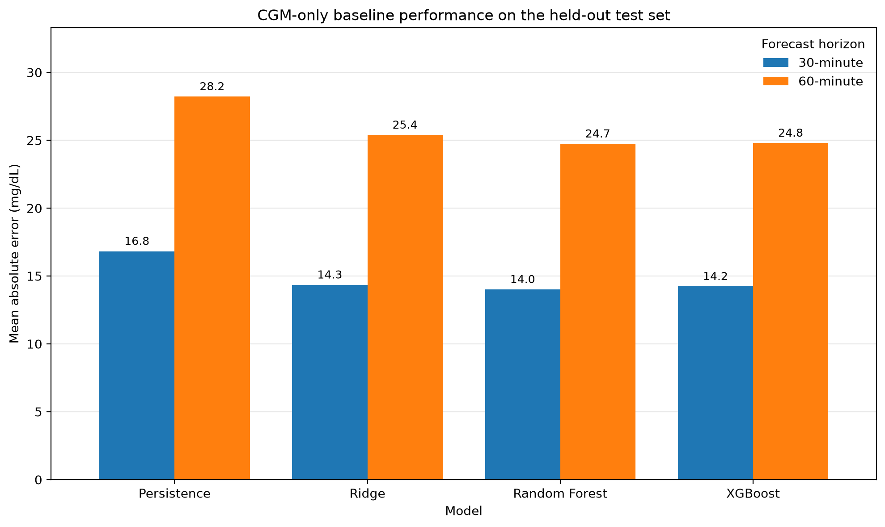
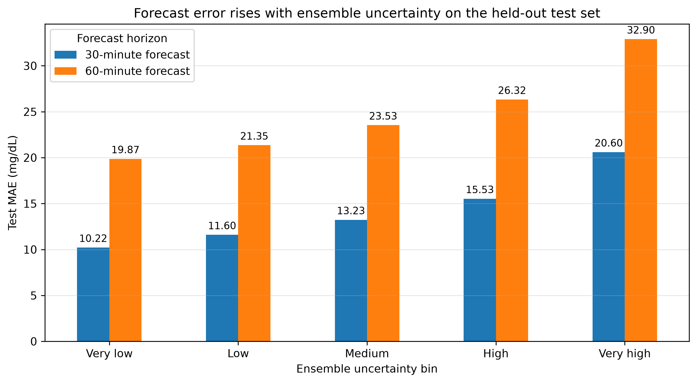
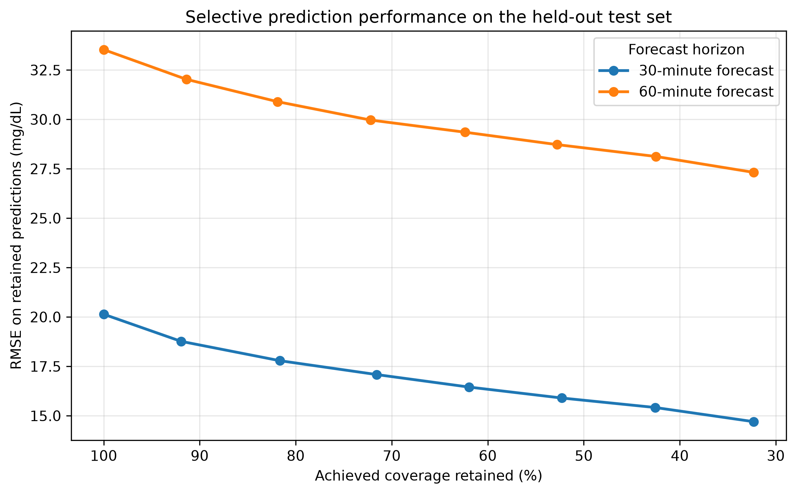

# GlucoTrust

Reliability-aware blood glucose forecasting from continuous glucose monitoring, meal, and insulin time-series data.

## Overview

GlucoTrust is a clinical machine learning project for short-term blood glucose forecasting. It predicts glucose 30 and 60 minutes into the future using continuous glucose monitoring (CGM), meal, bolus insulin, and basal-rate data.

The project focuses not only on predictive accuracy, but also on forecast reliability. A bootstrapped XGBoost ensemble estimates uncertainty through disagreement between independently trained models. This uncertainty signal is then evaluated through uncertainty stratification and selective prediction, where the system abstains from its least-confident forecasts.

The central objective is to investigate whether a glucose forecasting system can identify when its own predictions are more or less trustworthy.

## Research Question

Can short-term blood glucose be forecast from recent CGM, meal, and insulin data, and can ensemble uncertainty identify forecasts that are less reliable?

## Project Goals

- Build a reproducible forecasting pipeline from raw diabetes time-series XML data.
- Predict blood glucose 30 and 60 minutes into the future.
- Compare persistence, Ridge regression, Random Forest, and XGBoost baselines.
- Evaluate whether meal and insulin context improves forecasting beyond CGM history alone.
- Estimate uncertainty using disagreement within a bootstrapped XGBoost ensemble.
- Evaluate whether uncertainty is associated with forecast error.
- Use validation-calibrated uncertainty thresholds for selective prediction.
- Preserve a fully held-out test set for final reporting.
- Extend the project with patient-specific, event-specific, wearable, classification, and uncertainty-attribution analyses.

## Dataset

This project uses the official OhioT1DM dataset for blood glucose prediction research.

The current pipeline uses both the 2018 and 2020 OhioT1DM cohorts.

Dataset summary:

- 12 patients
- 24 XML files
- 12 original training files
- 12 original testing files
- 2018 cohort: 6 patients
- 2020 cohort: 6 patients
- Approximately 39–53 training days per patient
- Approximately 9.5–13.9 testing days per patient
- 1,507,154 parsed events
- 166,533 CGM glucose readings
- 2,168 meal events
- 3,733 bolus insulin events

Parsed event streams include:

- CGM glucose readings
- Finger-stick glucose measurements
- Basal insulin events
- Temporary basal insulin events
- Bolus insulin events
- Meal and carbohydrate events
- Sleep events
- Work events
- Stressor events
- Hypoglycemia events
- Illness events
- Exercise events
- Wearable heart rate
- Wearable GSR
- Wearable skin temperature
- Wearable air temperature
- Wearable steps
- Wearable sleep states
- Acceleration streams

## Dataset Source

The dataset was obtained directly from the original OhioT1DM source after requesting access.

Raw data files are not included in this repository. To reproduce the analysis, request access to the OhioT1DM dataset and place the XML files under `data/raw/OhioT1DM/`.

Original dataset reference:

Marling, C., & Bunescu, R. (2020). *The OhioT1DM Dataset for Blood Glucose Level Prediction*.

## Data Pipeline

The pipeline converts raw XML event streams into machine-learning-ready forecasting datasets.

Raw XML files are summarized in a manifest and parsed into event-level tables. CGM readings are then placed on a regular 5-minute timeline. Glucose-history features and meal, bolus, and basal context are constructed using only information available at or before each prediction timestamp.

The repaired pipeline uses causal feature construction:

- CGM gaps are filled only from past observations.
- Lagged glucose values are retrieved by exact timestamps rather than row offsets.
- Meal and insulin summaries use elapsed-time windows.
- Basal insulin is aligned using backward-looking timestamp matching.
- Forecast eligibility is determined separately for each prediction horizon.
- Future glucose values are used only as supervised learning targets.

Pipeline:

1. Raw XML files
2. XML manifest
3. Parsed event tables
4. Causal 5-minute CGM timeline
5. CGM-only forecasting dataset
6. CGM plus meal and insulin context dataset
7. Chronological train and validation construction
8. Baseline model evaluation
9. Bootstrapped XGBoost ensemble training
10. Validation-calibrated selective prediction
11. Held-out test evaluation
12. Visualization and report generation

Implemented scripts:

- `src/data/inspect_xml_files.py`
- `src/data/build_manifest.py`
- `src/data/parse_xml_events.py`
- `src/data/build_cgm_timeline.py`
- `src/features/build_cgm_lag_dataset.py`
- `src/features/build_context_dataset.py`
- `src/models/train_cgm_baselines.py`
- `src/models/train_context_baselines.py`
- `src/models/train_xgb_ensemble_uncertainty.py`
- `src/models/train_context_xgb_ensemble_uncertainty.py`
- `src/evaluation/selective_prediction.py`
- `src/evaluation/context_selective_prediction.py`
- `src/visualization/plot_cgm_baseline_results.py`
- `src/visualization/plot_context_comparison.py`
- `src/visualization/plot_uncertainty_bins.py`
- `src/visualization/plot_selective_prediction.py`
- `src/visualization/plot_context_selective_prediction.py`

## Prediction Setup

The project evaluates short-term glucose forecasting as a time-series regression task.

For each timestamp, the model uses recent patient history and available context to predict future glucose.

- Sampling interval: 5 minutes
- CGM input window: previous 2 hours
- Glucose lags: 0 to 120 minutes
- Forecast horizons: 30 and 60 minutes
- Main task: future glucose regression

At 5-minute sampling:

- Previous 2 hours = 24 time steps
- 30-minute forecast = 6 steps ahead
- 60-minute forecast = 12 steps ahead

## Evaluation Protocol

The OhioT1DM testing files remain fully held out until final evaluation.

For each patient, the original training timeline is divided chronologically into model-training and validation periods:

- The latest 20% of unique training timestamps forms the validation period.
- A 180-minute embargo separates model training from validation.
- Rows inside the embargo are excluded from model fitting and validation.
- No random splitting is used.
- Models are trained only on the chronological training portion.
- Model development and uncertainty thresholds use validation data.
- Final metrics are reported on the untouched original testing files.

For selective prediction:

1. Ensemble uncertainty thresholds are calculated from validation predictions.
2. Each threshold corresponds to a requested validation coverage.
3. The same threshold is transferred unchanged to the held-out test set.
4. Test coverage is therefore reported as achieved coverage, which may differ slightly from the requested validation coverage.

This prevents test-set information from influencing model selection or abstention thresholds.

## Processed Dataset

The processed context timeline contains:

- 188,959 total timeline rows
- 153,046 rows from the original training files
- 35,913 rows from the original held-out testing files
- 32 CGM history and trend features
- 26 meal and insulin context features
- 58 combined model features

Following chronological validation construction:

- 121,999 timeline rows are available for model training
- 30,615 timeline rows are available for validation
- 35,913 timeline rows remain in the held-out testing period

Forecast eligibility is horizon-specific.

### 30-minute forecasting

- 98,905 eligible model-training rows
- 24,854 eligible validation rows
- 29,001 eligible held-out test rows

### 60-minute forecasting

- 97,783 eligible model-training rows
- 24,470 eligible validation rows
- 28,600 eligible held-out test rows

### CGM features

CGM-only features include:

- Glucose lags from 0 to 120 minutes
- Glucose change over 30, 60, and 120 minutes
- Rolling glucose mean over 30 and 60 minutes
- Rolling glucose standard deviation over 30 and 60 minutes

### Meal and insulin context features

Context features include:

- Carbohydrates in the previous 30, 60, 120, and 180 minutes
- Meal counts in the previous 30, 60, 120, and 180 minutes
- Bolus insulin units in the previous 30, 60, 120, and 180 minutes
- Bolus event counts in the previous 30, 60, 120, and 180 minutes
- Bolus-calculator carbohydrate input in the previous 30, 60, 120, and 180 minutes
- Time since the most recent meal
- Time since the most recent bolus
- Current basal insulin rate
- Indicators showing whether prior meal, bolus, and basal information is known

## CGM-Only Baseline Results

The CGM-only models use glucose history and derived glucose-trend features without meal, bolus, or basal context.

The persistence baseline predicts that future glucose will equal the current glucose measurement.

All values below are from the held-out test files.

| Model | 30-min MAE | 30-min RMSE | 30-min R² | 60-min MAE | 60-min RMSE | 60-min R² |
|---|---:|---:|---:|---:|---:|---:|
| Persistence | 16.82 | 23.37 | 0.851 | 28.21 | 38.34 | 0.598 |
| Ridge Regression | 14.34 | 20.18 | 0.889 | 25.38 | 33.96 | 0.684 |
| Random Forest | **14.01** | **19.82** | **0.893** | **24.73** | **33.50** | **0.693** |
| XGBoost | 14.23 | 20.13 | 0.890 | 24.79 | 33.55 | 0.692 |



All learned models improve over persistence at both forecast horizons.

Random Forest produced the best CGM-only held-out performance:

- 30-minute MAE: 14.01 mg/dL
- 60-minute MAE: 24.73 mg/dL

The advantage over persistence is especially pronounced at 60 minutes, where assuming that glucose remains unchanged becomes substantially less accurate.

## CGM and Meal/Insulin Context Results

Meal, bolus, and basal features were added to test whether physiological context improves prediction beyond glucose momentum alone.

All values below are from the held-out test files.

| Model | Feature Set | 30-min MAE | 30-min RMSE | 30-min R² | 60-min MAE | 60-min RMSE | 60-min R² |
|---|---|---:|---:|---:|---:|---:|---:|
| Persistence | CGM only | 16.82 | 23.37 | 0.851 | 28.21 | 38.34 | 0.598 |
| Ridge Regression | CGM only | 14.34 | 20.18 | 0.889 | 25.38 | 33.96 | 0.684 |
| Random Forest | CGM only | 14.01 | 19.82 | 0.893 | 24.73 | 33.50 | 0.693 |
| XGBoost | CGM only | 14.23 | 20.13 | 0.890 | 24.79 | 33.55 | 0.692 |
| Ridge Regression | CGM + context | 13.92 | 19.62 | 0.895 | 24.57 | 32.93 | 0.703 |
| Random Forest | CGM + context | **13.69** | **19.41** | **0.897** | 23.94 | 32.51 | 0.711 |
| XGBoost | CGM + context | 13.86 | 19.65 | 0.895 | **23.86** | **32.31** | **0.714** |


Adding context improves every learned model at both horizons.

For Random Forest:

- 30-minute MAE improves from 14.01 to 13.69 mg/dL.
- 60-minute MAE improves from 24.73 to 23.94 mg/dL.

For XGBoost:

- 30-minute MAE improves from 14.23 to 13.86 mg/dL.
- 60-minute MAE improves from 24.79 to 23.86 mg/dL.

The improvement is larger at 60 minutes, which is consistent with meal and insulin events having more time to affect future glucose.

The best context models are:

- Random Forest at 30 minutes: 13.69 mg/dL MAE
- XGBoost at 60 minutes: 23.86 mg/dL MAE

## Ensemble Uncertainty

Forecast uncertainty is estimated using an ensemble of 10 XGBoost models.

Each model is trained using:

- A bootstrap sample of the chronological model-training data
- A different random seed
- The same feature definitions and forecast horizon

For each prediction:

- `ensemble_mean` is the average prediction across ensemble members.
- `ensemble_std` is the standard deviation across ensemble members.

The ensemble mean is used as the glucose forecast. Ensemble standard deviation is treated as a relative uncertainty score.

This uncertainty measure is not interpreted as a calibrated clinical confidence interval. Its purpose is to rank predictions from more confident to less confident.

## Ensemble Test Performance

### CGM-only ensemble

| Forecast Horizon | MAE | RMSE |
|---|---:|---:|
| 30 minutes | 14.23 | 20.14 |
| 60 minutes | 24.80 | 33.53 |

### CGM plus context ensemble

| Forecast Horizon | MAE | RMSE |
|---|---:|---:|
| 30 minutes | **13.81** | **19.59** |
| 60 minutes | **23.76** | **32.20** |

Adding meal and insulin context improves the ensemble mean at both forecast horizons.

Compared with the CGM-only ensemble:

- 30-minute MAE improves from 14.23 to 13.81 mg/dL.
- 30-minute RMSE improves from 20.14 to 19.59 mg/dL.
- 60-minute MAE improves from 24.80 to 23.76 mg/dL.
- 60-minute RMSE improves from 33.53 to 32.20 mg/dL.

## Uncertainty Bins

Held-out test predictions are sorted by ensemble uncertainty and divided into five equal-frequency groups:

- Very low: most confident 20%
- Low: next 20%
- Medium: middle 20%
- High: next 20%
- Very high: least confident 20%

For the CGM-only ensemble, forecast error increases monotonically with uncertainty.

| Uncertainty Bin | 30-min MAE | 60-min MAE |
|---|---:|---:|
| Very low | 10.22 | 19.87 |
| Low | 11.60 | 21.35 |
| Medium | 13.23 | 23.53 |
| High | 15.53 | 26.32 |
| Very high | 20.60 | 32.90 |



The most uncertain 20% of predictions have approximately twice the MAE of the least uncertain 20% at the 30-minute horizon.

This monotonic relationship indicates that ensemble disagreement contains useful information about actual forecast reliability.

## Selective Prediction

Selective prediction allows the system to abstain from forecasts with high ensemble uncertainty.

The uncertainty threshold for each requested coverage level is selected exclusively from validation predictions. That threshold is then transferred unchanged to the held-out test set.

Because the validation and test uncertainty distributions are not identical, the achieved held-out coverage may differ slightly from the requested validation coverage.

The retained predictions are not a random subset. They are specifically the predictions with the lowest ensemble uncertainty.

### CGM-only selective prediction

| Forecast Horizon | Achieved Test Coverage | RMSE on Retained Predictions |
|---|---:|---:|
| 30 minutes | 100.0% | 20.14 |
| 30 minutes | 81.7% | 17.79 |
| 30 minutes | 61.9% | 16.45 |
| 30 minutes | 42.6% | 15.42 |
| 30 minutes | 32.3% | 14.70 |
| 60 minutes | 100.0% | 33.53 |
| 60 minutes | 81.9% | 30.90 |
| 60 minutes | 62.4% | 29.35 |
| 60 minutes | 42.5% | 28.12 |



At the 30-minute horizon, RMSE decreases from 20.14 mg/dL at full coverage to 14.70 mg/dL when retaining approximately the most confident 32% of test predictions.

At the 60-minute horizon, RMSE decreases from 33.53 mg/dL at full coverage to 28.12 mg/dL at approximately 43% achieved coverage.

### Context selective prediction

Context-aware forecasts produce a lower coverage-error curve than CGM-only forecasts across the evaluated operating range.


Examples from the held-out test set:

| Forecast Horizon | Feature Set | Achieved Coverage | RMSE |
|---|---|---:|---:|
| 30 minutes | CGM only | 100.0% | 20.14 |
| 30 minutes | CGM + context | 100.0% | 19.59 |
| 30 minutes | CGM only | 81.7% | 17.79 |
| 30 minutes | CGM + context | 80.1% | 16.94 |
| 30 minutes | CGM only | 42.6% | 15.42 |
| 30 minutes | CGM + context | 41.0% | 13.96 |
| 60 minutes | CGM only | 100.0% | 33.53 |
| 60 minutes | CGM + context | 100.0% | 32.20 |
| 60 minutes | CGM only | 81.9% | 30.90 |
| 60 minutes | CGM + context | 78.0% | 28.79 |
| 60 minutes | CGM only | 42.5% | 28.12 |
| 60 minutes | CGM + context | 40.4% | 25.33 |

The context model remains more accurate than the CGM-only model at both full and reduced coverage.

At approximately 40% retained coverage:

- 30-minute context RMSE is 13.96 mg/dL, compared with 15.42 mg/dL for CGM only.
- 60-minute context RMSE is 25.33 mg/dL, compared with 28.12 mg/dL for CGM only.

These results support the main reliability claim of the project: ensemble disagreement can identify subsets of glucose forecasts with substantially lower error.

## Current Interpretation

The repaired evaluation supports five primary findings:

1. **Past glucose history is a strong predictor of short-term future glucose.**

   Learned models substantially outperform the persistence baseline, particularly at the 60-minute horizon.

2. **Meal and insulin context improves average forecast accuracy.**

   The improvement appears across Ridge regression, Random Forest, XGBoost, and the bootstrapped XGBoost ensemble.

3. **Context is more helpful at longer forecast horizons.**

   Meal, bolus, and basal information produce a larger improvement at 60 minutes than at 30 minutes.

4. **Ensemble disagreement is associated with forecast error.**

   Held-out MAE increases monotonically from the very-low-uncertainty bin to the very-high-uncertainty bin.

5. **Selective prediction improves reliability.**

   Rejecting forecasts with high validation-calibrated uncertainty reduces held-out error, and context-aware forecasts remain more accurate throughout the coverage-error tradeoff.

The reliability analysis is the central contribution of the project. GlucoTrust does not simply produce a glucose forecast; it also estimates when that forecast is comparatively less trustworthy.

## Limitations

The current results should be interpreted within several limitations:

- The dataset contains only 12 patients.
- Evaluation uses the dataset's original patient-specific train and test periods rather than testing on entirely unseen patients.
- Ensemble standard deviation is a relative uncertainty score, not a calibrated predictive interval.
- Selective prediction improves average error among retained predictions but does not establish clinical safety.
- Meal, bolus, and basal events may be incomplete or inconsistently recorded.
- The current analysis focuses on global regression metrics rather than hypoglycemia-specific sensitivity or clinical risk measures.
- Model hyperparameters have not been extensively optimized.
- The project has not been prospectively or externally validated.

## Planned Next Steps

### Patient-specific evaluation

Future work should evaluate whether performance and uncertainty behavior differ by patient.

Potential questions:

- Which patients have the highest forecast error?
- Which patients benefit most from context?
- Does uncertainty-error alignment vary across patients?
- Are high-uncertainty predictions concentrated in specific patients or periods?

### Event-specific evaluation

Future analysis should determine when meal and insulin context is most useful.

Potential comparisons:

- No recent meal or bolus
- Recent meal only
- Recent bolus only
- Recent meal and bolus
- Recent hypoglycemia event
- Recent exercise event

### Wearable and life-event features

Potential additions include:

- Heart-rate summaries
- Step counts
- Sleep indicators
- Exercise events
- Illness indicators
- Stressor indicators
- Work indicators
- Acceleration features

### Glucose-risk classification

Future versions may add clinically relevant classification tasks:

- Hypoglycemia risk: future glucose below 70 mg/dL
- Hyperglycemia risk: future glucose above 180 mg/dL
- Glucose-zone prediction: low, in range, or high

Potential metrics include:

- AUROC
- AUPRC
- Sensitivity
- Specificity
- F1 score
- Calibration error

### Uncertainty attribution

Future work will investigate why individual predictions receive high uncertainty.

Potential uncertainty drivers include:

1. An unstable recent glucose trajectory
2. Missing or inconsistent meal information
3. Strong disagreement about insulin effects
4. Activity or physiological patterns outside the training distribution

## Reproducibility

The raw dataset is not included in this repository.

Request access to the OhioT1DM dataset and place the XML files under:

- `data/raw/OhioT1DM/2018/train/`
- `data/raw/OhioT1DM/2018/test/`
- `data/raw/OhioT1DM/2020/train/`
- `data/raw/OhioT1DM/2020/test/`

Run the scripts from the repository root in the following order:

```bash
python -m src.data.build_manifest
python -m src.data.parse_xml_events
python -m src.data.build_cgm_timeline
python -m src.features.build_cgm_lag_dataset
python -m src.features.build_context_dataset

python -m src.models.train_cgm_baselines
python -m src.models.train_context_baselines
python -m src.models.train_xgb_ensemble_uncertainty
python -m src.models.train_context_xgb_ensemble_uncertainty

python -m src.evaluation.selective_prediction
python -m src.evaluation.context_selective_prediction

python -m src.visualization.plot_cgm_baseline_results
python -m src.visualization.plot_context_comparison
python -m src.visualization.plot_uncertainty_bins
python -m src.visualization.plot_selective_prediction
python -m src.visualization.plot_context_selective_prediction
```

Generated metrics are written under reports/, and figures are written under reports/figures/.

## Disclaimer

This project is for research and educational purposes only. It is not intended for medical diagnosis, treatment, insulin dosing, or other medical decision-making.