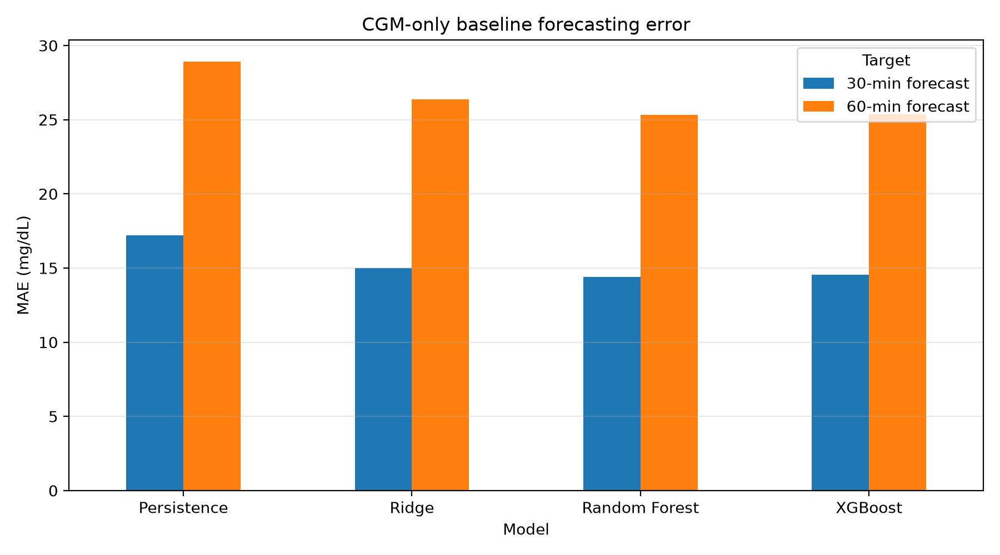
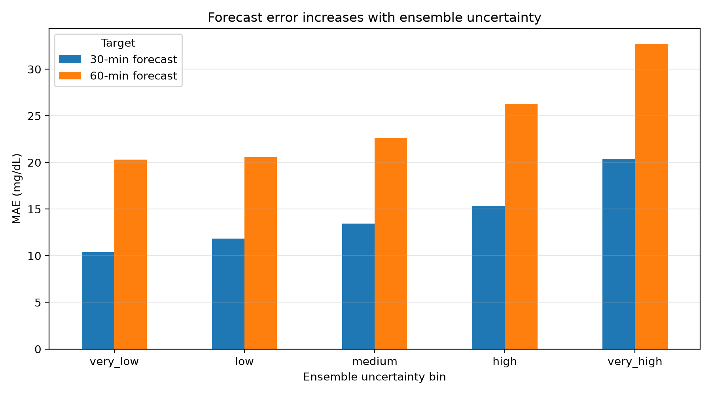
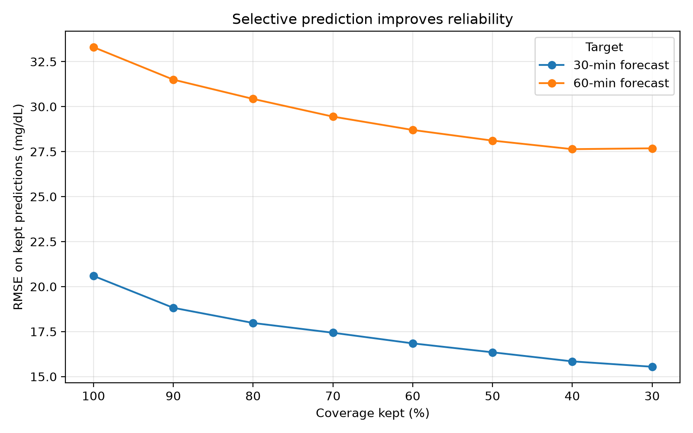

# GlucoTrust

Reliability-aware blood glucose forecasting from continuous glucose monitoring, insulin, meal, and activity data.

## Overview

GlucoTrust is a clinical machine learning project focused on short-term blood glucose forecasting. The goal is not only to predict future glucose values, but also to study when forecasts are unreliable and which input signals may be driving prediction instability.

The project is motivated by the idea that a forecasting model should not simply output a number. It should also communicate when its prediction may be difficult to trust, especially in safety-relevant situations such as hypoglycemia or hyperglycemia risk.

## Research Question

Can short-term blood glucose be forecast from recent CGM data, and can model uncertainty identify which forecasts are less reliable?

## Project Goals

- Build a reproducible glucose forecasting pipeline.
- Predict blood glucose 30 and 60 minutes into the future.
- Compare simple baselines, classical machine learning models, and boosted tree models.
- Evaluate forecast error, uncertainty, and selective prediction reliability.
- Analyze patient-specific reliability.
- Extend the pipeline with meal, insulin, activity, sleep, and wearable features.
- Study whether feature-level sensitivity can identify inputs that drive forecast instability.

## Dataset

This project uses OhioT1DM-style XML files containing patient-level diabetes time-series data.

The current dataset contains:

- 6 patients
- 12 XML files
- 6 training files
- 6 testing files
- Approximately 41-46 training days per patient
- Approximately 9.5-10.4 testing days per patient

Parsed event streams include:

- CGM glucose readings
- Finger-stick glucose measurements
- Basal insulin events
- Temporary basal insulin events
- Bolus insulin events
- Meal/carbohydrate events
- Sleep events
- Work events
- Stressor events
- Hypoglycemia events
- Illness events
- Exercise events
- Wearable heart rate
- Wearable GSR
- Wearable skin temperature
- Wearable air temperature
- Wearable steps
- Wearable sleep states

## Current Data Pipeline

The current pipeline converts raw XML event streams into a machine-learning-ready CGM forecasting dataset.

Raw XML files are first summarized in a manifest, then parsed into event-level tables. CGM readings are resampled into a regular 5-minute timeline, and lagged glucose features are generated for supervised forecasting.

Pipeline:

1. Raw XML files
2. XML file manifest
3. Parsed event tables
4. 5-minute CGM timeline
5. Lagged supervised forecasting dataset

Implemented scripts:

- `src/data/inspect_xml_files.py`
- `src/data/build_manifest.py`
- `src/data/parse_xml_events.py`
- `src/data/build_cgm_timeline.py`
- `src/features/build_cgm_lag_dataset.py`
- `src/models/train_cgm_baselines.py`
- `src/models/train_xgb_ensemble_uncertainty.py`
- `src/evaluation/selective_prediction.py`
- `src/visualization/plot_cgm_baseline_results.py`
- `src/visualization/plot_uncertainty_bins.py`
- `src/visualization/plot_selective_prediction.py`

## Prediction Setup

The first modeling setup uses CGM-only features.

For each timestamp, the model uses the previous 2 hours of glucose history to predict future glucose.

- Input window: previous 2 hours
- Sampling interval: 5 minutes
- Lag features: 0 to 120 minutes
- Forecast horizons: 30 minutes and 60 minutes
- Main task: future glucose regression

At 5-minute sampling:

- Past 2 hours = 24 previous time steps
- 30-minute forecast = 6 steps ahead
- 60-minute forecast = 12 steps ahead

## Current Processed Dataset

The CGM-only supervised dataset contains:

- 85,986 usable forecasting windows
- 70,035 training rows
- 15,951 testing rows
- 32 CGM-only lag/trend features
- 2 regression targets:
  - `target_glucose_30min`
  - `target_glucose_60min`

Current features include:

- glucose lag values from 0 to 120 minutes
- glucose change over 30, 60, and 120 minutes
- rolling glucose mean over 30 and 60 minutes
- rolling glucose standard deviation over 30 and 60 minutes

## Initial CGM-Only Results

The first baseline uses only past CGM glucose values, without meal, insulin, exercise, or wearable features.

Models evaluated:

- Persistence baseline
- Ridge regression
- Random forest regression
- XGBoost regression

The persistence baseline predicts that future glucose will equal current glucose.

| Model | 30-min MAE | 30-min RMSE | 30-min R² | 60-min MAE | 60-min RMSE | 60-min R² |
|---|---:|---:|---:|---:|---:|---:|
| Persistence | 16.48 | 22.96 | 0.862 | 27.47 | 36.93 | 0.642 |
| Ridge Regression | 14.56 | 20.67 | 0.888 | 25.21 | 33.59 | 0.703 |
| Random Forest | 14.31 | 20.59 | 0.889 | 24.83 | 33.73 | 0.701 |
| XGBoost | 14.28 | 20.63 | 0.888 | 24.58 | 33.44 | 0.706 |

Initial results show that machine learning models improve over the persistence baseline for both forecast horizons. The improvement is modest for 30-minute prediction, where current glucose is already a strong baseline, but becomes more meaningful at 60 minutes.

Ridge regression, random forest, and XGBoost perform similarly in the CGM-only setting. This suggests that much of the short-term signal is captured by glucose momentum and recent trend features.

## Initial Reliability Analysis

To estimate forecast uncertainty, the project trains an ensemble of 10 XGBoost models using bootstrapped training samples and different random seeds.

For each test prediction:

- `ensemble_mean` = average prediction across models
- `ensemble_std` = standard deviation across models

The ensemble mean is used as the final forecast. The ensemble standard deviation is used as an uncertainty estimate.

| Target | MAE | RMSE | R² | Uncertainty-error Spearman |
|---|---:|---:|---:|---:|
| 30-min glucose | 14.29 | 20.60 | 0.889 | 0.221 |
| 60-min glucose | 24.50 | 33.30 | 0.709 | 0.184 |

The ensemble achieved similar or slightly better performance than a single XGBoost model. More importantly, ensemble uncertainty was positively associated with actual forecast error.

## Uncertainty Bins

Predictions were sorted by ensemble uncertainty and split into five equal-frequency bins:

- very low uncertainty = most confident 20% of predictions
- low uncertainty = next 20%
- medium uncertainty = middle 20%
- high uncertainty = next 20%
- very high uncertainty = least confident 20% of predictions

At 30 minutes, median absolute error increased from 7.23 mg/dL in the lowest-uncertainty bin to 14.82 mg/dL in the highest-uncertainty bin.

At 60 minutes, median absolute error increased from 14.93 mg/dL to 26.19 mg/dL.

This suggests that ensemble disagreement provides a useful, though imperfect, signal for identifying less reliable glucose forecasts.

## Selective Prediction

Selective prediction evaluates whether the model can improve reliability by abstaining from forecasts with high ensemble uncertainty.

Predictions are ranked from lowest uncertainty to highest uncertainty. Then the model keeps only the most confident predictions at each coverage level.

For example:

- 100% coverage = keep all predictions
- 80% coverage = keep the most confident 80%, reject the most uncertain 20%
- 60% coverage = keep the most confident 60%, reject the most uncertain 40%
- 40% coverage = keep the most confident 40%, reject the most uncertain 60%
- 30% coverage = keep the most confident 30%, reject the most uncertain 70%

This is not random subsampling. The retained predictions are specifically the predictions with the lowest ensemble uncertainty.

| Target | Coverage | RMSE |
|---|---:|---:|
| 30-min glucose | 100% | 20.59 |
| 30-min glucose | 80% | 17.98 |
| 30-min glucose | 60% | 16.85 |
| 30-min glucose | 40% | 15.85 |
| 30-min glucose | 30% | 15.55 |
| 60-min glucose | 100% | 33.30 |
| 60-min glucose | 80% | 30.43 |
| 60-min glucose | 60% | 28.70 |
| 60-min glucose | 40% | 27.64 |
| 60-min glucose | 30% | 27.68 |

As coverage decreases, RMSE generally improves on the retained predictions. This supports a practical trust mechanism: the model can provide forecasts when confidence is higher and flag uncertain cases for caution or further verification.

## Current Interpretation

The current CGM-only results support three early findings:

1. Past glucose history provides a strong baseline for short-term glucose forecasting.
2. Machine learning models improve over persistence, especially for 60-minute forecasts.
3. XGBoost ensemble uncertainty is meaningfully associated with forecast error.

The reliability results are more important than the raw accuracy gains. The model does not simply output a glucose forecast; it also provides an uncertainty signal that can help identify when the forecast is more or less trustworthy.

## Planned Next Steps

### Add meal and insulin features

The next version will add contextual features such as:

- carbohydrates in the last 30, 60, and 120 minutes
- bolus insulin in the last 30, 60, and 120 minutes
- current basal insulin rate
- time since last meal
- time since last bolus

This will test whether food and insulin context improves forecasts beyond glucose momentum alone.

### Add wearable and life-event features

Later versions may add:

- heart rate summaries
- step counts
- sleep indicators
- exercise events
- illness indicators
- stressor indicators
- work indicators

### Add classification tasks

In addition to regression forecasting, the project can also define classification tasks:

- hypoglycemia risk: future glucose below 70 mg/dL
- hyperglycemia risk: future glucose above 180 mg/dL
- glucose zone prediction: low / in-range / high

This would allow evaluation using classification metrics such as AUROC, AUPRC, sensitivity, specificity, F1, and calibration.

### Add uncertainty attribution

Future work will study why predictions are uncertain by testing whether specific features drive prediction instability.

Example output goal:

Prediction uncertainty is high.

Possible uncertainty drivers:

1. Recent glucose trend is unstable.
2. Meal context is missing or inconsistent.
3. Insulin context strongly changes the forecast.
4. Wearable/activity pattern is outside typical training behavior.

## Disclaimer

This project is for research and educational purposes only. It is not intended for medical decision-making.
